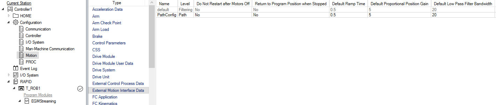
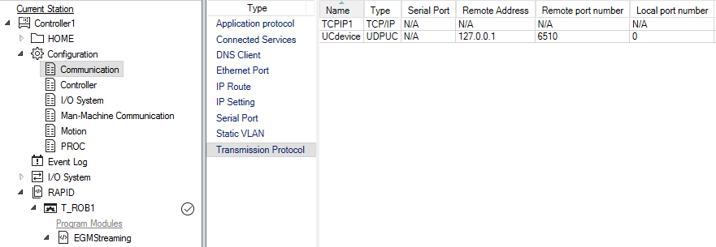

# abb-egm-with-python
A basic setup that allows for interfacing with ABB's Externally Guided Motion (EGM) option in python. This repo contains the files needed to get EGM communication working with an ABB robot controller. 

## Python Setup
The main file is PythonEGM.py. This script sets up a UDP listening client to receive and deserialize the EGM messages from the controller. It also includes examples of assembling and serializing Position Guidance messages and Path Correction messages to send back to the controller for those applications.

You must include the egm_pb2.py file in the same folder as PythonEGM.py as this file contains the necessary information for the protocol buffer to serialize and deserialize messages based on the message structure in the .proto file. The raw egm.proto(found on ABB controller) structure file is included for reference. When compiled for use in Python language the egm.proto file becomes egm_pb2.py.

You will need to install the python protobuf library, and may need to recompile the egm.proto file yourself if the egm_pb2.py file is giving you issues.

If recompilation of the egm.proto file is required, basic knowledge of working with protocol buffers is necessary. In python, information about compiling proto files, adding data to message structure, serializing and sending messages, and parsing serialized messages can be found at: [https://protobuf.dev/getting-started/pythontutorial/](https://protobuf.dev/getting-started/pythontutorial/)

Basic knowledge of socket communication is also necessary. Everything is set up for EGM communication locally on one machine with RobotStudio. For use with physical controller, update the ip address appropriately to ensure messages are sent/received correctly. EGM uses UDP to continuously send and receive messages. More information about socket communication can be found at: https://docs.python.org/3/library/socket.html

## Controller Setup
Necessary setup to prepare ABB Controller for EGM:

Make sure to add in the 689-1 Externally Guided Motion RobotWare option for the controller (if virtual), then make the subsequent changes in the controller configuration tab:
```
Motion
	-External Motion Interface Data
		-Create new External motion data with the following options:
			-Name: This name is referenced in the rapid code as the ExtConfigName string when using the EGMStartupUC command to create the EGM connection
			-Level: must be set to Path for use with Path Correction, Raw or Filtered for Position Guidance or Position Streaming
			-Position Gain:	determines motion responsiveness, higher values equal faster response (used with Position Guidance Only)
			-Filter Bandwidth: value used to filter the speed contribution from EGM (used with Position Guidance Only)
			-Ramp Time: determines how fast the speed should be ramped to zero after motion is complete (used with Position Guidance Only)
```				


```
Communication
	- Transmission Protocol
		-May need to create a new transmission protocol with the following options:
			-Name: This name is referenced as the UCDevice name in the EGMStartupUC command
			-Type: must turn type to UDPUC standard
			-Remote Address: The ip address of the sensor(computer)
			-Remote Port Number: The port number of the sensor(computer)
```


An example RAPID module is included for position streaming. For examples using Position Guidance or Path Correction, as well as information on EGM RAPID commands and general setup information consult the appropriate ABB EGM manual for your Robotware version: [https://library.e.abb.com/public/4c9bfa6a4e9542bf9386c87f5377a27f/3HAC073319%20AM%20Externally%20Guided%20Motion%20RW6-en.pdf?x-sign=W42ZwkRuP3q1Dr78NoMTFHI0DdPMmb7ezINcsvqB/Ij7YxK7rdtzREC7RSoHvQJW  ](https://library.abb.com/r?dkg=dkg_instructions%20and%20manuals&q=EGM)

Written with RobotWare 6.14


Author: Jonas Beachy, University of Washington
